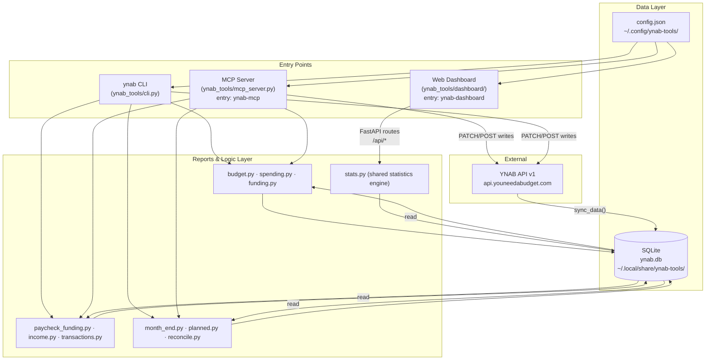

# ynab-tools

A CLI toolkit for managing your YNAB (You Need A Budget) data locally. Syncs your budget to a SQLite database and provides tools for payee cleanup, transaction management, category management, planned expense tracking, account reconciliation, net worth tracking, and brokerage data import.

## Why?

YNAB is great for budgeting, but when bank transactions import, payee names come in as messy strings like `CHEVRON 44512 SOMETOWN GA` or `LOWES FOODS #1832`. Over time, you end up with dozens of duplicate payees and miscategorized transactions. This toolkit automates the cleanup:

- **Sync** your YNAB data to a local SQLite database for fast querying
- **Audit** payee names to find where bank imports created mismatches
- **Fix** payee names in bulk using regex-based rules
- **Normalize** duplicate payees (e.g., merge "KROGER" and "Kroger" into one)
- **Categorize** uncategorized transactions using payee history and keyword matching
- **Create** transactions, split transactions, and manage categories from the CLI
- **Plan** upcoming expenses and track funding gaps against category balances
- **Reconcile** accounts against real-world balances
- **Track** net worth, retirement accounts, and debt payoff over time
- **Import** brokerage statements (Fidelity, Merrill Lynch) into YNAB format

## Architecture

ynab-tools has three runtime surfaces - CLI, MCP server, and web dashboard - that share the same local SQLite database and reports layer.



## Installation

Requires Python 3.11+.

**Recommended (`uv` - installs `ynab`, `ynab-mcp`, and `ynab-dashboard` globally):**

```bash
uv tool install .
```

**With web dashboard support:**

```bash
uv tool install ".[dashboard]"
```

**Dev/editable install:**

```bash
git clone https://github.com/mrlesmithjr/mcp.git
cd mcp/packages/ynab-tools
uv tool install --editable ".[dashboard]"
```

All install methods register three entry points: `ynab` (CLI), `ynab-mcp` (MCP server), and `ynab-dashboard` (web dashboard).

## Configuration

Run the setup wizard:

```bash
ynab configure
```

The wizard detects 1Password (`op`) if installed and offers it as an input source. Otherwise prompts for manual entry and saves to `~/.config/ynab-tools/config.json`.

**Getting your access token:** Log in to YNAB → Account Settings → Developer Settings → Personal Access Tokens → Create New Token.

**Finding your plan ID:** Set your access token first, then run:

```bash
ynab plans
```

See [Configuration](docs/configuration.md) for environment variable overrides, manual config.json setup, and all optional settings.

## Quick Start

```bash
# 1. Sync your YNAB data locally (do this first - most commands need it)
ynab sync

# 2. See what's in the database
ynab sync --status

# 3. Audit your payee names
ynab payee audit

# 4. Preview what the rules would fix
ynab payee preview

# 5. Apply fixes (creates a backup first, asks for confirmation)
ynab payee fix
```

## Documentation

| Document | Contents |
|----------|----------|
| [Getting Started](docs/getting-started.md) | Step-by-step setup: install, credentials, first sync, Claude Code MCP setup, verification |
| [Configuration](docs/configuration.md) | Full env var reference, config precedence, all optional settings |
| [Commands](docs/commands.md) | Complete reference for all CLI commands |
| [Workflows](docs/workflows.md) | Paycheck day, month-end, weekly review, and payee cleanup workflows with diagrams |
| [MCP Server](docs/mcp-server.md) | MCP setup for Claude Code and Claude Desktop, all 47 tool descriptions |
| [Dashboard](docs/dashboard.md) | Web dashboard install, service management, views, and calibration logic |
| [Database](docs/database.md) | Schema, table reference, ERD, data files, and direct SQL queries |

## YNAB API Notes

- **Rate limit:** 200 requests/hour. The client automatically spaces requests and retries on 429 responses.
- **Bulk updates:** Payee fixes and categorization use YNAB's bulk transaction update endpoint (max 1000 per call).
- **Amounts:** YNAB stores amounts in milliunits (1 dollar = 1000). Conversion happens during sync.
- **Payee deletion:** The YNAB API does not support deleting payees - orphaned payees must be removed manually in the YNAB UI.
- **API paths:** All endpoints use `/plans/` (renamed from `/budgets/` in YNAB API v1.79.0). Config accepts both `YNAB_PLAN_ID` and `YNAB_BUDGET_ID`.
