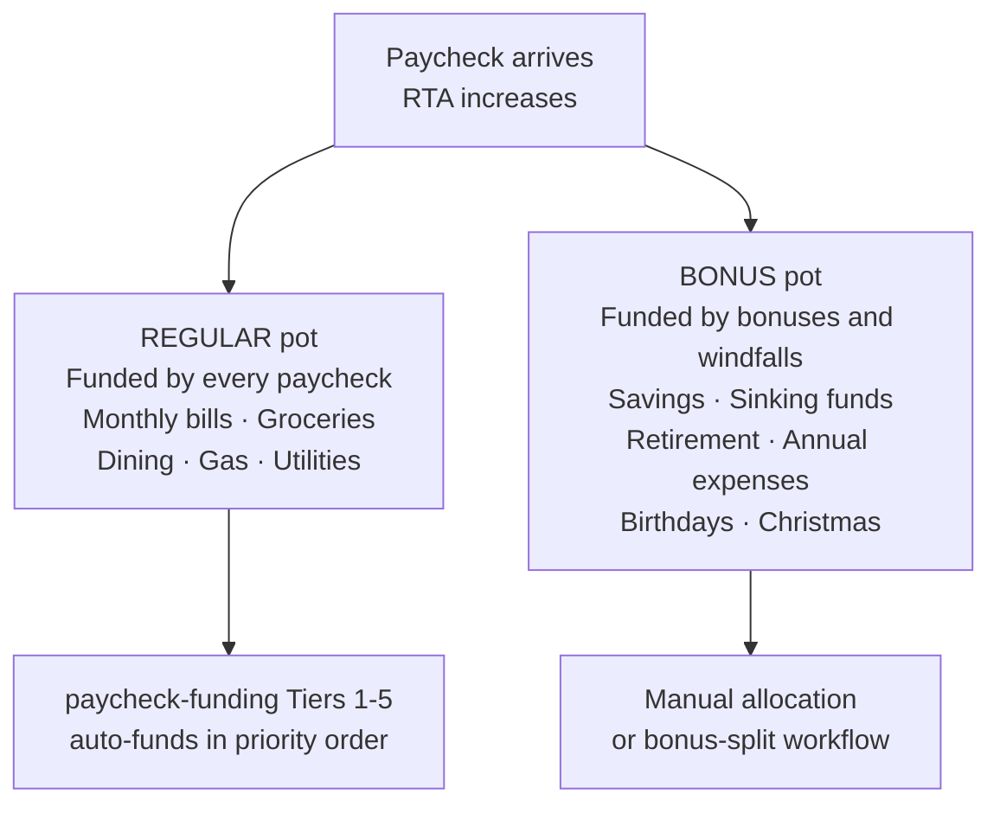
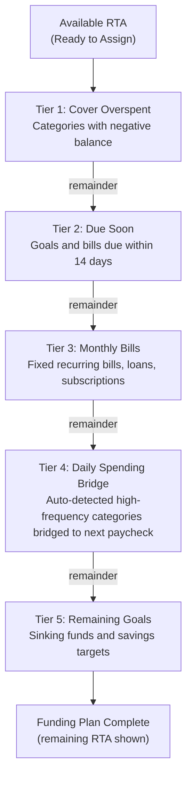

# Command Reference

All commands follow the pattern `ynab <command> [options]`. Run `ynab --help` or `ynab <command> --help` for usage at any time.

## `ynab sync` - Sync YNAB Data

Downloads your budget data from YNAB into a local SQLite database. Uses YNAB's delta sync to only fetch what has changed since last time.

```bash
ynab sync                # Delta sync (fast - only changes since last sync)
ynab sync --full         # Full sync (re-downloads everything)
ynab sync --months 24    # Sync 24 months of history (default: 12)
ynab sync --status       # Show database stats without syncing
```

**What gets synced:** accounts, budget months with category breakdowns, transactions (including subtransactions/splits), and payees.

**Delta sync:** After the first sync, subsequent runs only fetch changes using YNAB's `server_knowledge` mechanism. Use `--full` to force a complete re-download.

---

## `ynab plans` - List YNAB Budget Plans

Lists all YNAB plans (formerly called budgets) accessible with your API token, showing each plan's ID and name. Use this during initial setup to find the plan ID for `ynab configure`.

```bash
ynab plans
```

Requires YNAB API credentials. The configure wizard now references this command for plan discovery.

> **Note:** `ynab payee plans` is deprecated. Use `ynab plans` instead.

---

## `ynab payee` - Payee Management

The payee tools clean up messy bank import names. Workflow: **audit → preview → fix**.

### `ynab payee audit`

Finds transactions where YNAB's payee name does not match the original bank import name - but filters out legitimate renames. Groups results by payee with transaction counts and dollar totals.

```
## 'Valero' (4 transactions, $156.23)
  - VALERO GAS #123 SOMETOWN: 3 txns ($112.45)
  - VALERO #456 OTHERTOWN: 1 txns ($43.78)
```

### `ynab payee preview`

Dry-run showing what fixes `ynab_tools/data/payee_rules.json` would apply, and which mismatches have no matching rule yet.

```
## Proposed Fixes:
  Valero Gas → Valero: 4 transactions ($156.23)

## No Rule Matched:
  - SOME UNKNOWN STORE #789: 2 transactions
```

### `ynab payee fix`

Applies the proposed fixes. Creates a JSON backup first and asks for confirmation before making any changes via the YNAB API.

### `ynab payee normalize`

Finds duplicate payee names that normalize to the same thing (e.g., "KROGER", "Kroger", "Kroger #1234"). Shows the merge groups and how they would consolidate.

```bash
ynab payee normalize          # Preview duplicates
ynab payee normalize --apply  # Merge them (with confirmation)
```

Skips transactions older than 5 years. Creates a backup before applying.

### `ynab payee orphaned`

Finds payees in YNAB that have zero transactions - candidates for manual deletion. (The YNAB API does not support deleting payees; the tool tells you how to do it in the YNAB UI.)

```bash
ynab payee orphaned          # Check against local DB
ynab payee orphaned --api    # Check against live API data
```

### `ynab payee validate`

Checks that all rules in `ynab_tools/data/payee_rules.json` reference payee names listed in the `canonical_payees` section. Catches typos in rules before a fix run.

### `ynab payee backups` / `ynab payee restore`

```bash
ynab payee backups                              # List available backups
ynab payee restore backup_20251216_135748.json  # Undo a previous fix
```

---

## `ynab budget` - Budget Check

Shows your current budget status: Ready to Assign, overspent categories, categories near their limit (>80% spent), and underfunded goals.

```bash
ynab budget                                    # Full budget status
ynab budget --month 2026-03                    # Historical month
ynab budget --cc-audit                         # Credit card payment vs balance audit
ynab budget --overspend-plan                   # Auto-classify overspent categories
ynab budget --overspend-plan --month 2026-03   # Overspend plan for a past month
```

Output sections:
- **OVERSPENT** - categories with negative balance
- **NEAR LIMIT** - categories >80% spent
- **UNDERFUNDED GOALS** - goal targets not fully funded
- **UPCOMING PLANNED EXPENSES** - planned expenses due within 30 days with funding gaps
- **BUDGET HEALTH RATIOS** - housing, auto, debt service, and retirement as percentage of gross income vs Money Guy guidelines (requires `YNAB_GROSS_SALARY`)

### `ynab budget --overspend-plan`

Auto-classifies each overspent category to help determine the right coverage source:

| Label | Meaning |
|-------|---------|
| STRUCTURAL | Overspent 3+ of the last 6 months - target needs adjustment |
| SEASONAL | Overspent in the same calendar month last year |
| ONE-OFF | Single large transaction accounts for >60% of the overspend |
| TIMING FLOAT | Reimbursable category with inflows expected |

---

## `ynab summary` - Monthly Income vs Spending Overview

```bash
ynab summary               # Last 6 months
ynab summary --months 12   # Last 12 months
```

Shows income, spending, and net per month. Flags surplus and DEFICIT months with totals and averages.

---

## `ynab spending` - Monthly Spending Report

Shows current month spending by category compared to budget targets. Flags categories over budget (`***`) or near limit (`*`).

```bash
ynab spending                          # Current month
ynab spending --months 6               # Multi-month comparison
ynab spending breakdown                # Fixed vs discretionary breakdown
ynab spending breakdown --months 12    # Breakdown over 12 months
```

> **Deprecated:** `ynab spending --breakdown` still works but prints a deprecation notice to stderr. Use `ynab spending breakdown` instead.

**Single month** (default): income vs expenses, top 5 spending categories, net cash flow.

**Multi-month** (`--months`): monthly summary table plus per-category breakdown with averages and over-budget markers.

**Breakdown** (`ynab spending breakdown`): Classifies spending into fixed (bills, mortgage, insurance), discretionary (dining, groceries, hobbies), savings, and other. Uses `ynab_tools/data/category_classification.json` if present, otherwise auto-classifies based on spending variance.

---

## `ynab spending-pace` - Mid-Month Spending Pace

Shows intra-month spending pace per category compared to the monthly budget and 3-month trailing average. Flags categories running hot (on pace to exceed budget), on track, or underspent relative to elapsed days.

```bash
ynab spending-pace                # Current month
ynab spending-pace --month 2026-04  # Specific month
```

DB-only - no YNAB API credentials required.

---

## `ynab trends` - Category Spending Trends

Shows 6-month spending history for a specific category with budget vs actual, trend direction, and current month transaction detail.

```bash
ynab trends "Groceries"           # Exact or partial category match
ynab trends "dining" --months 12  # 12-month trend
```

---

## `ynab debt` - Debt Status

Shows all debt accounts (loans, mortgage) and credit cards carrying a balance. Calculates average monthly payments and estimates months to payoff. Flags debts within 6 months of payoff.

```bash
ynab debt
```

---

## `ynab recent` - Recent Transactions

Shows the most recent transactions with split transactions properly resolved (each split line shown as its own row with the correct category and amount).

```bash
ynab recent                             # Last 25 transactions
ynab recent -n 50                       # Last 50
ynab recent --account "Checking"        # Filter by account name
ynab recent --payee "Amazon"            # Filter by payee
ynab recent --category "Dining"         # Filter by category
ynab recent --memo "refund"             # Filter by memo text
ynab recent --uncleared                 # Only pending/uncleared transactions
ynab recent --month 2026-03             # All transactions from March 2026
ynab recent --uncleared --month 2026-03 # Pending March transactions
```

All filters compose - combine any of `--account`, `--payee`, `--category`, `--memo`, `--uncleared`, and `--month` together. When `--month` is used, the default limit increases to 500 (override with `-n`).

Flags uncategorized `[!]` and unapproved `[?]` transactions.

---

## `ynab large` - Large Expenses

Shows expenses over a threshold, grouped by month. Useful for spotting unexpected large charges.

```bash
ynab large                             # Expenses > $500, last 6 months
ynab large --threshold 1000            # Expenses > $1000
ynab large --threshold 200 --months 3  # Expenses > $200, last 3 months
```

---

## `ynab income` - Income Analysis

Shows monthly income breakdown separating regular paychecks from bonus portions. Detects quarterly bonus patterns, flags the next expected bonus month, and compares year-to-date income against the prior year.

```bash
ynab income              # Last 12 months
ynab income --months 24  # Last 24 months
```

Output includes:
- **Bonus paychecks** - paychecks above your configured threshold are split into regular pay and bonus portion (set `YNAB_REGULAR_PAY` and `YNAB_BONUS_THRESHOLD` in config)
- **Monthly breakdown** - regular pay, bonus, other income, and total per month
- **YTD comparison** - current year vs same period last year with percentage change
- **Bonus pattern** - detects quarterly bonus cadence and predicts next bonus month

---

## `ynab transfers` - Recent Transfers

Shows account transfers from the last 30 days, flagging any that are uncategorized. On-budget transfers between your own accounts are normally "Uncategorized" in YNAB - the tool notes this so you only worry about debt payments missing a category.

```bash
ynab transfers              # Last 30 days
ynab transfers --days 60    # Last 60 days
```

---

## `ynab balance` - Category Balance Lookup

Looks up the current month's balance, budgeted amount, activity, and goal status for any category by name (partial match, case-insensitive).

```bash
ynab balance "Emergency Fund"
ynab balance "Holding"
ynab balance "groceries"
```

**CC payoff goal display:** For credit card payment categories with a "Pay Off Balance by Date" goal (`goal_type = TBD`), the YNAB API stores `goal_target = 0` and puts the remaining payoff amount in `goal_overall_left`. `ynab balance` detects this case and displays `goal_overall_left` with the due month rather than the (always-zero) `goal_target`. The monthly shortfall shown is `goal_under_funded` (refs #208).

---

## `ynab sinking-funds` - Sinking Fund Status

Shows all categories with YNAB goals: which are fully funded, which are underfunded (and by how much), and which have gone negative. Flags categories that have been consistently underfunded for 3+ months.

```bash
ynab sinking-funds
```

---

## `ynab fund` - Category Funding

Set or adjust budgeted amounts for categories directly from the CLI, fund all underfunded goals in one shot, or review a spending-based analysis of what your budget should be.

```bash
# Set a category to a specific amount
ynab fund "Groceries" 850

# Adjust relative to current budget
ynab fund "Groceries" +100         # Add $100
ynab fund "Dining Out" -50         # Subtract $50

# Target a specific month
ynab fund "Groceries" 850 --month 2026-04

# Fund all underfunded goals
ynab fund goals                    # Dry-run
ynab fund goals --apply            # Push changes to YNAB

# Funding status with recommendations
ynab fund status

# View funding audit log
ynab fund log              # Last 20 entries
ynab fund log 50           # Last 50 entries
```

> **Reserved subcommand names:** If you have a category literally named "status", "log", or "goals", prefix it with the group name to disambiguate: `ynab fund "Monthly Bills: goals" 500`.

> **Deprecated flag forms** (`--status`, `--log`, `--goals`, `--goals --apply`) still work but print a deprecation notice to stderr and will be removed in a future release. Use the subcommand forms above.

### `ynab fund status`

Shows every budgeted category with four key columns:

| Column | Meaning |
|--------|---------|
| Target | YNAB goal target amount |
| Avg Spend | 12-month average (raw) |
| Recommend | Trimmed average (highest and lowest months dropped) rounded up to nearest $5 |
| Budgeted | Current month's budgeted amount |

Flags when the recommendation diverges from the budget:
- **under by $X** - consistently spending more than budgeted
- **over by $X** - budgeting more than you typically spend
- **high variance** - spending too erratic to recommend
- **moderate variance** - recommendation shown but flagged with `*` for judgment
- **insufficient data** - fewer than 3 months of history

---

## `ynab unapproved` - Unapproved Transactions

Lists unapproved transactions separated into "needs category" and "ready to approve" groups. Verifies approval status against the YNAB API to catch stale local data from delta sync gaps.

```bash
ynab unapproved
```

---

## `ynab approve` - Approve Transactions

```bash
ynab approve TX_ID              # Approve by transaction ID (prefix match)
ynab approve TX_ID --apply      # Skip confirmation
ynab approve --all              # Approve all categorized unapproved transactions
ynab approve --all --apply      # Skip confirmation
```

---

## `ynab update` - Update Transactions

Change the category or memo on an existing transaction.

```bash
ynab update TX_ID --category "Groceries"
ynab update TX_ID --memo "Weekly groceries"
ynab update TX_ID --category "Groceries" --apply
```

---

## `ynab delete` - Delete Transactions

Permanently deletes a transaction via the YNAB API.

```bash
ynab delete TX_ID             # Shows confirmation prompt
ynab delete TX_ID --apply     # Skip confirmation
```

---

## `ynab categorize` - Auto-Categorize Transactions

Suggests categories for uncategorized transactions using three signals:

1. **Typical payee match** (HIGH confidence) - payee is defined in `ynab_tools/data/category_definitions.json` for a specific category
2. **Historical pattern** (MEDIUM confidence) - payee consistently categorized the same way in past transactions
3. **Disambiguation rules** (LOW confidence) - rules for multi-category stores like Target, Amazon, Walmart

```bash
ynab categorize          # Preview suggestions with confidence levels
ynab categorize --apply  # Push HIGH-confidence suggestions to YNAB
```

Output markers:
- `[+]` HIGH - applied with `--apply`
- `[~]` MEDIUM - review recommended
- `[?]` LOW - manual decision needed

---

## `ynab net-worth` - Net Worth Tracking

Takes point-in-time snapshots of account balances and stores them in the database. Running it twice on the same day updates the existing snapshot rather than creating a duplicate.

```bash
ynab net-worth                # Take a snapshot (or update today's)
ynab net-worth --history      # Show trend (last 12 snapshots)
ynab net-worth --history 24   # Last 24 snapshots
ynab net-worth --detail       # Latest snapshot with per-account breakdown
```

---

## `ynab add` - Create Transactions

```bash
ynab add "Checking" 45.00 --payee "Kroger" --category "Groceries"
ynab add "Checking" 45.00 --payee "Kroger" --memo "Weekly groceries" --apply
ynab add "Checking" 100.00 --payee "Refund" --inflow           # Record as inflow
ynab add "Checking" 45.00 --payee "Kroger" --date 2026-03-15   # Specific date
ynab add "Checking" 45.00 --payee "Kroger" --cleared uncleared # Uncleared status
```

Without `--apply`, shows a confirmation prompt before creating the transaction via the YNAB API.

---

## `ynab split` - Split Transactions

Finds transactions that may need to be split across multiple categories and suggests how to split them.

```bash
ynab split              # Find split candidates
ynab split 1            # Review candidate #1 in detail
ynab split 1 --apply    # Apply the suggested split
```

---

## `ynab category` - Category Management

```bash
# Create a new category in an existing group
ynab category create "Pet Insurance" --group "Monthly Bills"
ynab category create "Pet Insurance" --group "Monthly Bills" --apply

# Set a monthly funding target
ynab category set-goal "Groceries" 900                        # MF type - $900/month
ynab category set-goal "Vacation" 5000 --type TBD --by-date 2026-12  # Target balance by date

# Remove a goal
ynab category clear-goal "Old Category"
ynab category clear-goal "Old Category" --apply

# Create a new category group
ynab category create-group "New Group"
```

**Goal types:**

| Type | Meaning |
|------|---------|
| MF (default) | Monthly funding: need this amount every month |
| TB | Target balance: build up to this amount over time |
| TBD | Target balance by date: reach this amount by a specific month |
| NEED | Monthly spending target |

**TBD goal API behavior:** The YNAB API silently converts `goal_type="TBD"` back to `"TB"` for regular savings categories on write. The target date is stored correctly in `goal_target_month`, but the YNAB app will show "Eventually" instead of a deadline because it reads `goal_type`. To make the deadline permanent in the YNAB app, do a one-time manual save: open the category in the YNAB app, edit the target, select "Target Balance by Date", pick the same month, and save. After that manual save, YNAB returns `"TBD"` natively in API responses. ynab-tools normalizes `TB + goal_target_month` to `TBD` in the local database at sync time so all downstream tools (sinking funds, paycheck funding, upcoming goals) treat dated savings goals correctly regardless of what the API returns.

---

## `ynab plan` - Planned Expenses

Track upcoming large or one-time expenses and see how they compare to current category balances. Planned expenses are stored locally and surface in `ynab budget` output when due within 30 days.

```bash
# List active planned expenses with funding gaps
ynab plan

# Add a planned expense
ynab plan add "Spa & Nails" 165 --by 2026-04-15 --memo "Appointment next month"
ynab plan add "Auto: Maintenance" 800 --by 2026-05-01

# Mark as completed
ynab plan done 1

# Remove
ynab plan remove 2
```

The **funding gap** shows how much more you need to save: if your category has $50 and the planned expense is $165, the gap is $115. Fully funded expenses show "Funded" instead. Overdue expenses (past due date but still active) are flagged.

---

## `ynab reconcile` - Account Reconciliation

```bash
ynab reconcile                             # Show all accounts with balances
ynab reconcile "Checking" 1234.56          # Compare YNAB vs actual balance
ynab reconcile "Checking" 1234.56 --apply  # Create adjustment transaction
```

---

## `ynab retirement` - Retirement Tracking

```bash
ynab retirement              # Balances and current year contributions
ynab retirement --year 2025  # Specific year's contributions
ynab retirement --project    # Growth projections to retirement
ynab retirement --debug      # Per-transaction classification table (for tuning payee config)
```

**Contribution limits** are US IRS values and must be updated each year (or when moving to a different country's contribution system). Override any limit via env var or `config.json`:

| config.json key | Env var | Default (2026) | Description |
|-----------------|---------|----------------|-------------|
| `limit_401k_employee` | `YNAB_LIMIT_401K_EMPLOYEE` | 23500 | 401(k) employee under-50 limit |
| `limit_401k_catchup` | `YNAB_LIMIT_401K_CATCHUP` | 7500 | 401(k) age-50+ catch-up |
| `limit_401k_total` | `YNAB_LIMIT_401K_TOTAL` | 70000 | 401(k) total 415(c) limit |
| `limit_ira` | `YNAB_LIMIT_IRA` | 7500 | IRA under-50 limit |
| `limit_ira_catchup` | `YNAB_LIMIT_IRA_CATCHUP` | 1100 | IRA age-50+ catch-up |
| `limit_year` | `YNAB_LIMIT_YEAR` | 2026 | Tax year shown in output label |

**Projection settings** (used by `--project`). Configure via env var or `config.json`:

| config.json key | Env var | Default | Description |
|-----------------|---------|---------|-------------|
| `birth_year` | `YNAB_BIRTH_YEAR` | (none) | Birth year used to calculate current age; enables age-based milestone rows (60, 62, 65, 67, 70) in projection output |
| `retirement_milestones` | `YNAB_RETIREMENT_MILESTONES` | (none) | Custom projection milestones as `age:label` pairs, comma-separated (e.g. `67:Target retirement,60:Pension starts`) |
| `retirement_rate` | `YNAB_RETIREMENT_RATE` | 7 | Annual nominal growth rate as a percentage (used by dashboard; CLI `--project` currently hardcodes 7%) |
| `retirement_max_age` | `YNAB_RETIREMENT_MAX_AGE` | 90 | Oldest age shown in projection output |
| `employer_match_pct` | `YNAB_EMPLOYER_MATCH_PCT` | (none) | Employer 401(k) match as a percentage of gross OTE; combined with `gross_ote` or `gross_salary` to estimate annual employer contribution |
| `gross_ote` | `YNAB_GROSS_OTE` | (none) | Annual gross OTE used to compute the employer match estimate in projections (takes precedence over `gross_salary` when both are set) |
| `gross_salary` | `YNAB_GROSS_SALARY` | (none) | Annual gross base salary; fallback for employer match estimate when `gross_ote` is not set |

**Payee classification** controls which YNAB payee names count as employee contributions, employer match, or plan fees. The defaults match Fidelity and Merrill Lynch naming. Override via env var or `config.json` if your custodian uses different names:

| config.json key | Env var | Default | Description |
|-----------------|---------|---------|-------------|
| `retirement_contrib_payees` | `YNAB_RETIREMENT_CONTRIB_PAYEES` | `Contribution,Purchase` | Payees counted as employee contributions |
| `retirement_match_payees` | `YNAB_RETIREMENT_MATCH_PAYEES` | `Credit` | Payees counted as employer match |
| `retirement_fee_payees` | `YNAB_RETIREMENT_FEE_PAYEES` | `401k Fee,Fee,Plan Sponsor Fee,Recordkeeping Fee,Merrill Lynch 401k Fee` | Payees counted as plan fees |

Use `ynab retirement --debug` to print a per-transaction table showing how each payee is classified. If contributions show as $0, run `--debug` first to identify the payee names that need to be added to `YNAB_RETIREMENT_CONTRIB_PAYEES`.

See [Configuration: Retirement Tracking](configuration.md#retirement-tracking) for the full reference.

---

## `ynab month-end` - Month-End Closeout Report

Consolidated report for closing out a budget month. Combines income summary, spending vs budget, overspent categories (with structural flags), uncategorized/unapproved counts, pending transactions, available surplus, and planned expenses - all in one command.

```bash
ynab month-end                    # Auto-detects closing month
ynab month-end --month 2026-03    # Specific month
```

**Auto-detection:** If run on the 1st-5th of the month, defaults to the previous month. Otherwise uses the current month.

**Protected categories:** The surplus section excludes categories that should not be used for overspend coverage (savings, emergency fund, retirement). Configure via `YNAB_PROTECTED_GROUPS` and `YNAB_PROTECTED_NAMES`.

---

## `ynab subscriptions` - Recurring Subscription Detection

Lists recurring subscription charges detected from transaction history. Groups results by subscription name with frequency, estimated monthly and annual cost, and next renewal date.

```bash
ynab subscriptions
```

Detection uses a 24-month lookback window to catch annual subscriptions. Categories and payees are classified as subscriptions when the same payee charges on a consistent monthly or annual cadence.

Output columns:
- **Name** - payee or subscription name
- **Frequency** - monthly, annual, or inferred cadence
- **Monthly cost** - normalized to a per-month figure
- **Next renewal** - estimated next charge date

---

## `ynab paycheck` - Paycheck Forecast

Projects upcoming paycheck dates and amounts based on historical patterns. Detects bi-weekly cadence and quarterly bonus cycles.

```bash
ynab paycheck              # Default forecast
ynab paycheck --months 6   # Longer projection
```

---

## The Two-Pot System

ynab-tools separates your budget into two distinct funding pots. Understanding this is key to using `ynab breakdown`, `ynab paycheck-funding`, and `ynab bonus-split` correctly.



Configure which categories belong to the bonus pot with `YNAB_BONUS_FUNDED_GROUPS` and `YNAB_BONUS_FUNDED_CATEGORIES`. Categories in the bonus pot are excluded from paycheck funding tiers 3-5 so only regular-pot obligations surface during normal pay periods.

---

## `ynab breakdown` - Paycheck Budget Breakdown

Shows how the current month's budget is funded: which categories are covered by the regular paycheck vs which are funded by bonuses. Helps you understand your true monthly baseline separate from variable bonus-funded categories.

```bash
ynab breakdown              # Current month
ynab breakdown --month 2026-03
```

---

## `ynab bonus-split` - Bonus Split Analysis

When a paycheck includes a bonus component (above your regular pay threshold), shows how to split the bonus portion across sinking funds, savings, and one-time spending goals vs the regular portion that covers monthly operations.

```bash
ynab bonus-split
ynab bonus-split --apply
```

> **Note:** `ynab bonus_split` is a deprecated alias that still works but prints a deprecation notice. Use `ynab bonus-split` instead.

---

## `ynab paycheck-funding` - Paycheck Funding Plan

Generates a prioritized funding plan that allocates your available RTA across budget categories in a deliberate order. Designed to run after each paycheck arrives.

```bash
ynab paycheck-funding              # Preview the funding plan
ynab paycheck-funding --apply      # Execute through Tier 2 (safe default)
ynab paycheck-funding --apply --through-tier 4  # Fund through monthly bills
```

> **Note:** `ynab paycheck_funding` (underscore) is a deprecated alias that still works but prints a deprecation notice. Use `ynab paycheck-funding` instead.

### Five-Tier Waterfall



Bonus-pot categories (savings, sinking funds, retirement, annual expenses) are excluded from Tiers 3-5 - they surface only through the `bonus-split` workflow or manual funding. Categories in `YNAB_EXCLUDED_GROUPS` / `YNAB_EXCLUDED_CATEGORIES` are skipped before the bonus/regular classification runs, with one exception: CC payment categories that carry an active "Pay Off Balance by Date" goal are included in Tier 3 as monthly bill obligations even though their group (`Credit Card Payments`) is normally excluded.

**Tier 3 bridge top-up:** If a category appears in Tier 3 (monthly bills) and also qualifies as daily spending, its funding amount is augmented to cover the bridge target in one line. The bridge delta is added directly to the Tier 3 `amount_needed` so the category does not appear separately in Tier 4.

**Tier 4 auto-detection:** Eligible categories are detected automatically from spend history using two filters. No hardcoded list is used.

| Filter | Rule |
|--------|------|
| Consistency | Must have spend in at least 2 distinct calendar months over the 3-month lookback |
| Lumpiness | Max single-month spend must not exceed 2.5x the average monthly spend (average always divides by 3, not by months with spend) |

Categories that pass both filters are bridged at their 90-day daily spend rate, scaled to days until the next paycheck. Auto: Fuel and similar frequent-spend categories qualify automatically; event-driven categories (gifts, vacations) are excluded by the lumpiness filter.

---

## `ynab two-pot` - Two-Pot Compliance Report

Shows whether regular-pot categories were over-allocated relative to your regular pay in each bonus month. The primary metric is the structural compliance calculation: total budgeted to regular-pot categories minus regular monthly pay. This metric uses all funding sources (not just ynab-tools operations), so when TBB is $0 it is exact; when TBB is positive it is a lower bound.

```bash
ynab two-pot               # Last 3 bonus months (default)
ynab two-pot --months 6    # Last 6 bonus months
ynab two-pot --month 2026-04  # Specific bonus month only
```

Requires `YNAB_REGULAR_PAY` and `YNAB_BONUS_THRESHOLD` to be configured.

**Output per bonus month:**

- **Structural backwards / surplus** - how much regular-pot budgeted exceeded (or fell under) regular monthly pay. Marked `exact` when TBB is $0, otherwise `lower bound (TBB=$X)`.
- **Holding: Next Month delta** - balance change in your Holding category between the prior month and the bonus month. A negative delta in a bonus month is a warning signal: Holding drew down instead of growing.
- **Top regular-pot categories** - the five largest regular-pot categories by budgeted amount, identifying likely over-allocation culprits.
- **Workflow gap** - sum of regular-pot adds recorded in `funding_log` after the bonus paycheck date (ynab-tools operations only). This may double-count top-ups and is supplemental to the structural metric.

---

## `ynab audit` - Audit Log

View the audit log of all actions performed by ynab-tools.

```bash
ynab audit                         # Last 30 entries
ynab audit -n 50                   # Last 50 entries
ynab audit --action set-goal       # Filter by action type
ynab audit --action create-transaction
```

---

## `ynab import brokerage` - Brokerage Import

Converts brokerage CSV statements into YNAB's import format (Date, Payee, Memo, Amount).

```bash
ynab import brokerage statement.csv --preview    # See what it will import
ynab import brokerage statement.csv              # Output YNAB CSV to stdout
ynab import brokerage statement.csv -o ynab.csv  # Save to file
ynab import brokerage statement.csv --push --account "Fidelity"  # Push to YNAB
```

**Supported brokerages:**
- **Fidelity** - individual and multi-account exports (detects "Run Date"/"Action" headers)
- **Merrill Lynch** - 401(k) exports (detects account name header + "Date"/"Transaction" columns)

Transaction types (dividends, reinvestments, contributions, fees, purchases, sales) are mapped to descriptive payee names with the original action and symbol in the memo field.

---

## `ynab import boa` - Bank of America Import

Converts a Bank of America transaction CSV export into YNAB's import format (Date, Payee, Memo, Amount).

```bash
ynab import boa statement.csv --preview              # See what it will import
ynab import boa statement.csv                        # Output YNAB CSV to stdout
ynab import boa statement.csv -o ynab.csv            # Save to file
ynab import boa statement.csv --push --account "BofA Visa"  # Push to YNAB
```

**BoA CSV format:** `Posted Date, Reference Number, Payee, Address, Amount`

- Amounts are signed: negative = charge, positive = credit or refund
- The Address field (city/state) is written to the YNAB Memo column
- Import IDs use the BoA Reference Number for collision-safe deduplication

---

## `ynab import positions` - Fidelity Positions Import

Import Fidelity portfolio positions CSV for reconciling investment account balances.

```bash
ynab import positions positions.csv               # Preview positions
ynab import positions positions.csv --reconcile    # Generate reconciliation commands
ynab import positions positions.csv --reconcile --apply  # Apply via YNAB API
```

---

## `ynab dashboard` - Web Dashboard

Runs the web dashboard (requires the `dashboard` extra). Running `ynab dashboard` with no subcommand shows status output identical to `ynab dashboard status`.

```bash
ynab dashboard                         # Show dashboard status (same as ynab dashboard status)
ynab dashboard status                  # Running/stopped, URL, recent log lines
ynab dashboard install                 # Install as macOS LaunchAgent (auto-syncs hourly)
ynab dashboard restart                 # Restart after upgrades or config changes
ynab dashboard logs                    # Tail the log file
ynab dashboard uninstall               # Stop and remove the LaunchAgent
ynab dashboard start                   # Foreground mode - http://127.0.0.1:8000
ynab dashboard start --port 8080       # Custom port
ynab dashboard start --reload          # Dev mode with auto-reload
ynab dashboard start --sync-interval 60  # Auto-sync every 60 minutes
```

See [Dashboard](dashboard.md) for full setup, calibration logic, and view descriptions.
