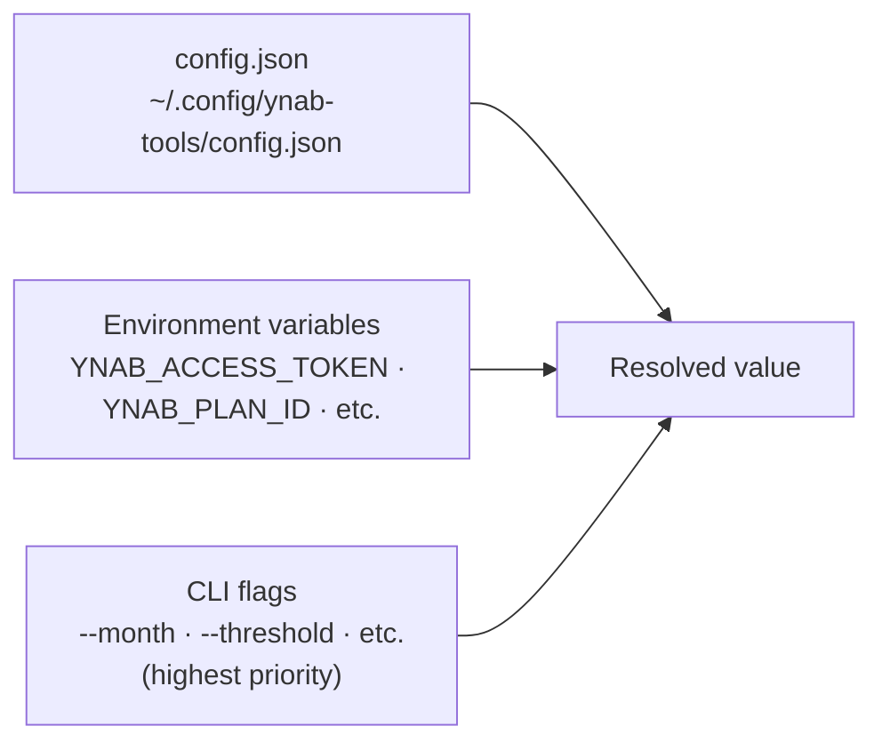

# Configuration

ynab-tools uses a layered configuration system. Higher-priority sources override lower ones:



## Setup Wizard

```bash
ynab configure                               # set credentials interactively
ynab configure --show                        # print all values and their sources
ynab configure --reset bonus_funded_groups   # remove one optional setting
ynab configure --reset                       # interactive: pick a setting to clear
```

Detects 1Password (`op`) if installed and offers it as a credential source. Otherwise prompts for manual entry. Saves to `~/.config/ynab-tools/config.json` with mode 600.

The wizard defaults to looking for a vault item named `YNAB`. Set this to match your vault layout:

| Variable | config.json key | Default | Description |
|----------|----------------|---------|-------------|
| `YNAB_1PASSWORD_ITEM` | `onepassword_item` | `YNAB` | 1Password item name containing `access_token` and `plan_id` fields |

`--show` lists every supported config key, its current value (access token masked), and whether it came from config.json, an environment variable, or is not set. `--reset` removes optional settings from config.json; credentials (`access_token`, `plan_id`) cannot be cleared this way.

## Manual config.json

Create `~/.config/ynab-tools/config.json` directly:

```json
{
  "access_token": "your-personal-access-token",
  "plan_id": "your-budget-uuid"
}
```

The config file also accepts the same keys as the env vars below (snake_case, without the `YNAB_` prefix).

## Environment Variables

Environment variables override config file values - useful for CI, containers, or switching between budgets:

```bash
export YNAB_ACCESS_TOKEN=your-token
export YNAB_PLAN_ID=your-budget-uuid   # also accepts YNAB_BUDGET_ID
```

## Optional Configuration

Additional variables enable advanced features. Set via environment, `.env`, or equivalent keys in `config.json`.

### Data Storage

| Variable | Description |
|----------|-------------|
| `YNAB_DATA_DIR` | Override data directory (default: `~/.local/share/ynab-tools/`) |

### Income and Paycheck Analysis

| Variable | Used By | Description |
|----------|---------|-------------|
| `YNAB_REGULAR_PAY` | `ynab income`, `ynab paycheck` | Typical semi-monthly paycheck amount |
| `YNAB_BONUS_THRESHOLD` | `ynab income`, `ynab paycheck` | Paychecks above this are flagged as containing a bonus |
| `YNAB_PAYCHECK_PAYEES` | `ynab income`, `ynab paycheck`, dashboard income | Comma-separated payee names for income sources (auto-detected if unset) |
| `YNAB_INCOME_PAYEES` | `ynab paycheck` | Paycheck-specific payee override; takes precedence over `YNAB_PAYCHECK_PAYEES` when set |

### Budget Health Ratios

Requires `YNAB_GROSS_SALARY` to enable the health ratios section in `ynab budget`.

| Variable | Used By | Description |
|----------|---------|-------------|
| `YNAB_GROSS_SALARY` | `ynab budget` | Annual gross base salary for budget health ratios |
| `YNAB_GROSS_OTE` | `ynab budget` | Annual gross OTE (base + bonus) for health ratios |
| `YNAB_RETIREMENT_ANNUAL` | `ynab budget` | Annual total retirement contributions for health ratios |
| `YNAB_RATIO_HOUSING` | `ynab budget` | Comma-separated category names for housing ratio (default: `Mortgage & Rent`) |
| `YNAB_RATIO_AUTO` | `ynab budget` | Comma-separated category names for auto loan ratio (default: `Auto Loan`) |
| `YNAB_RATIO_DEBT` | `ynab budget` | Comma-separated category names for total debt service ratio |

### Retirement Tracking

| Variable | Used By | Description |
|----------|---------|-------------|
| `YNAB_RETIREMENT_401K` | `ynab retirement` | YNAB account name for your 401(k) |
| `YNAB_RETIREMENT_ROTH_IRA` | `ynab retirement` | YNAB account name for your Roth IRA |
| `YNAB_RETIREMENT_TRAD_IRA` | `ynab retirement` | YNAB account name for your Traditional IRA |
| `YNAB_RETIREMENT_TAXABLE` | `ynab retirement` | YNAB account name for taxable brokerage |
| `YNAB_BIRTH_YEAR` | `ynab retirement` | Birth year for age-based projections |
| `YNAB_RETIREMENT_MILESTONES` | `ynab retirement` | Custom milestones: `67:Retire,62:Early eligible` |
| `YNAB_RETIREMENT_RATE` | `ynab retirement`, dashboard | Annual nominal growth rate as a percentage (default: `7`). Used for projection charts. |
| `YNAB_RETIREMENT_MAX_AGE` | `ynab retirement` | Oldest age shown in projection output (default: `90`) |
| `YNAB_EMPLOYER_MATCH_PCT` | `ynab retirement`, dashboard | Employer 401(k) match as a percentage of gross OTE (e.g. `4` for 4%). Used in contribution pace and limit tracking. |

#### Retirement Payee Classification

These variables control which YNAB payee names are treated as employee contributions, employer match, and plan fees. The defaults match Fidelity and Merrill Lynch transaction naming. If your custodian uses different names (Vanguard, Schwab, Empower, or others), override these to match what appears in your YNAB transactions.

| Variable | Used By | Description |
|----------|---------|-------------|
| `YNAB_RETIREMENT_CONTRIB_PAYEES` | `ynab retirement` | Comma-separated exact payee names classifying employee contributions (default: `Contribution,Purchase`) |
| `YNAB_RETIREMENT_MATCH_PAYEES` | `ynab retirement` | Comma-separated exact payee names classifying employer match (default: `Credit`) |
| `YNAB_RETIREMENT_FEE_PAYEES` | `ynab retirement` | Comma-separated exact payee names classifying plan fees (default: `401k Fee,Fee,Plan Sponsor Fee,Recordkeeping Fee,Merrill Lynch 401k Fee`) |

Run `ynab retirement --debug` to print a per-transaction classification table (date, payee, amount, type) and see exactly how your transactions are being mapped. This is the fastest way to identify which payee names need to be added or overridden.

### Social Security (Dashboard Retirement Page)

Optional. When configured, the Retirement dashboard page shows a Social Security card with claim-age scenarios and combined portfolio+SS income projections. The page degrades gracefully if these variables are not set.

| Variable | config.json key | Description |
|----------|----------------|-------------|
| `YNAB_SS_FRA_BENEFIT` | `ss_fra_benefit` | Monthly SS benefit at full retirement age (dollars) |
| `YNAB_SS_FRA_AGE` | `ss_fra_age` | Full retirement age in years (e.g. `67`) |
| `YNAB_SS_DELAYED_BENEFIT` | `ss_delayed_benefit` | Monthly SS benefit if claiming at the delayed age (dollars) |
| `YNAB_SS_DELAYED_AGE` | `ss_delayed_age` | Age for the delayed-claim scenario (e.g. `70`) |
| `YNAB_SS_EARLY_BENEFIT` | `ss_early_benefit` | Monthly SS benefit if claiming early (dollars) |
| `YNAB_SS_EARLY_AGE` | `ss_early_age` | Age for the early-claim scenario (e.g. `62`) |
| `YNAB_SS_STATEMENT_DATE` | `ss_statement_date` | Date of the SSA statement these figures come from (YYYY-MM-DD); shown on the card to prompt annual refresh |

Values come from your Social Security statement at ssa.gov. Update annually - the statement date field is a reminder to do so.

### Two-Pot Budget System

Controls which categories belong to the bonus pot vs the regular paycheck pot. See [Commands: paycheck-funding](commands.md#ynab-paycheck-funding--paycheck-funding-plan) for how pots are used during funding.

| Variable | Description |
|----------|-------------|
| `YNAB_BONUS_FUNDED_GROUPS` | Comma-separated group name substrings that are bonus-pot funded. Also controls which donor groups are deprioritized in the dashboard overspend-plan waterfall (sinking funds / savings are listed last as donors). |
| `YNAB_BONUS_FUNDED_CATEGORIES` | Comma-separated exact category names that are bonus-pot funded |
| `YNAB_EXCLUDED_GROUPS` | Group substrings excluded from all paycheck funding tiers (default: `Credit Card Payments,Internal Master Category`) |
| `YNAB_EXCLUDED_CATEGORIES` | Exact category names excluded from all paycheck funding tiers |
| `YNAB_HOLDING_CATEGORY` | Category name for the bonus holding bucket used by `ynab bonus-split` (default: `Holding: Next Month`) |

### Month-End Protected Categories

| Variable | Description |
|----------|-------------|
| `YNAB_PROTECTED_GROUPS` | Group name fragments excluded from surplus coverage (default: `Emergency,Savings,Retirement,Holding,Investment`) |
| `YNAB_PROTECTED_NAMES` | Exact category names excluded from surplus coverage |

### Subscription Analytics

| Variable | Description |
|----------|-------------|
| `YNAB_SUBSCRIPTION_CATEGORIES` | Comma-separated category names scanned for subscriptions (default: `Subscriptions (Personal),Subscriptions (Business)`) |
| `YNAB_NON_SUBSCRIPTION_PAYEES` | Comma-separated payees to exclude as non-recurring |
| `YNAB_PAYEE_PREFIX_OVERRIDES` | `prefix\|canonical` pairs for bank-mangled names (e.g. `CANVA*\|Canva`) |
| `YNAB_PAYEE_NAME_OVERRIDES` | `exact name\|canonical` pairs for payees where import name is unavailable |

### Brokerage Import

| Variable | Description |
|----------|-------------|
| `YNAB_FIDELITY_ACCOUNTS` | JSON mapping Fidelity account numbers to YNAB names |

### Dashboard

| Variable | config.json key | Description |
|----------|----------------|-------------|
| `DASHBOARD_PASSWORD` | `dashboard_password` | When set, all dashboard routes require HTTP Basic auth (password only; username is ignored). Unset = no auth (safe for localhost-only use). |
| `YNAB_DASHBOARD_SYNC_INTERVAL` | `dashboard_sync_interval_minutes` | Auto-sync interval in minutes (0 = disabled). CLI `--sync-interval` flag takes precedence. |

### Dashboard: Savings Progress

Category names used by the `/api/overview/savings-progress` endpoint. Override these if your YNAB categories have different names.

| Variable | config.json key | Default |
|----------|----------------|---------|
| `YNAB_EMERGENCY_FUND_CATEGORY` | `emergency_fund_category` | `Savings: Emergency Fund` |
| `YNAB_SAVINGS_GENERAL_CATEGORY` | `savings_general_category` | `Savings: General` |
| `YNAB_SAVINGS_LONG_TERM_CATEGORY` | `savings_long_term_category` | `Savings: Long-Term` |

### Dashboard: Home Spending

Category prefix used by the `/api/overview/home-spending` endpoint. Override this if your home expense categories use a different prefix.

| Variable | config.json key | Default |
|----------|----------------|---------|
| `YNAB_HOME_CATEGORY_PREFIX` | `home_category_prefix` | `Home:` |

The endpoint discovers all categories whose name starts with this prefix. Set it to match whatever prefix your YNAB budget uses for home expense categories (e.g. `House:` or `Housing:`).
