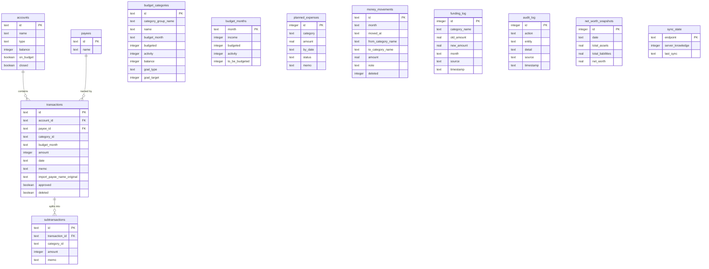

# Database

All data is stored in a local SQLite database at `~/.local/share/ynab-tools/ynab.db`. Override the location with `YNAB_DATA_DIR`.

Backups from payee fix/normalize operations are stored alongside the database in `~/.local/share/ynab-tools/backups/`.

## Direct Querying

```bash
# Most active payees
sqlite3 ~/.local/share/ynab-tools/ynab.db \
  "SELECT payee_name, COUNT(*) as cnt FROM transactions WHERE deleted=0 GROUP BY payee_name ORDER BY cnt DESC LIMIT 20"

# This month's spending by category group
sqlite3 ~/.local/share/ynab-tools/ynab.db \
  "SELECT category_group_name, SUM(ABS(activity))/1000.0 as spent FROM budget_categories WHERE budget_month = strftime('%Y-%m-01', 'now') GROUP BY category_group_name ORDER BY spent DESC"
```

Reference queries for common analyses are in `ynab_tools/data/queries.sql`.

## Tables

| Table | Contents |
|-------|----------|
| `accounts` | Account names, types, on-budget flag, closed flag |
| `transactions` | Transaction history: payee, category, import names, approval status |
| `subtransactions` | Split transaction line items. Sync uses delete-before-insert per parent transaction to handle YNAB's ID regeneration on split edits; a startup migration cleans any pre-existing duplicates via `last_synced_at` ordering (issue #27). |
| `payees` | Payee list synced from YNAB |
| `budget_months` | Monthly income, budgeted, activity, and RTA totals |
| `budget_categories` | Per-category budgeted/activity/balance/goal by month |
| `net_worth_snapshots` | Historical net worth snapshots (assets, liabilities, net) |
| `planned_expenses` | Locally tracked upcoming expenses with due dates and status |
| `money_movements` | All budget moves synced from the YNAB API - captures CLI and YNAB app moves; authoritative source for budget move analytics |
| `funding_log` | Local-only audit trail of ynab-tools CLI category budget changes |
| `audit_log` | Log of all ynab-tools actions (funding, transactions, goals) |
| `sync_state` | Delta sync tracking: `server_knowledge` token per endpoint |
| `sync_log` | Sync history with timestamps and row counts |

## Schema



## Data Files

### `ynab_tools/data/payee_rules.json`

Regex rules mapping messy bank import names to clean canonical payee names and categories:

```json
{
  "canonical_payees": {
    "Chevron": {"category": "Auto: Fuel"},
    "Lowes Foods": {"category": "Groceries"}
  },
  "rules": [
    {
      "import_pattern": "^CHEVRON.*",
      "correct_payee": "Chevron",
      "correct_category": "Auto: Fuel"
    }
  ]
}
```

**Adding a new rule:**
1. Run `ynab payee audit` to see the import pattern
2. Add a regex rule to the `rules` array
3. Add the payee to `canonical_payees` if it is new
4. Run `ynab payee validate` to check for typos
5. Run `ynab payee preview` to verify matches
6. Run `ynab payee fix` to apply

### `ynab_tools/data/category_definitions.json`

Defines what each budget category covers: keywords, typical payees, and disambiguation rules for multi-category stores. Used by `ynab categorize`.

### `ynab_tools/data/category_classification.json`

Optional configuration for `ynab spending breakdown`. Maps YNAB category names to spending types (fixed, discretionary, savings). Copy the example and customize:

```bash
cp ynab_tools/data/category_classification.example.json ynab_tools/data/category_classification.json
# Edit to match your category names
```

If this file does not exist, the tool auto-classifies based on spending variance (low-variance = fixed, high-variance = discretionary).

### `ynab_tools/data/queries.sql`

Reference SQL queries for ad-hoc analysis against `ynab.db`. Run them directly with `sqlite3 ynab.db < ynab_tools/data/queries.sql` or use them interactively.

## YNAB Amount Format

YNAB stores all amounts in milliunits (1 dollar = 1000 milliunits). The sync converts these to dollars for display, but raw values in the database are in milliunits. When writing direct SQL, divide by 1000.0:

```sql
SELECT payee_name, amount / 1000.0 as dollars FROM transactions WHERE amount < 0 LIMIT 10;
```
