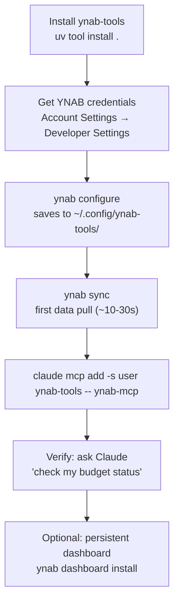

# Getting Started with ynab-tools and Claude Code

This guide walks you through getting ynab-tools fully operational: installed, configured, synced, and available as an MCP server inside Claude Code so you can manage your budget through natural language from any project.

## Prerequisites

- [YNAB account](https://app.youneedabudget.com) with at least one budget
- Python 3.11+
- [`uv`](https://docs.astral.sh/uv/) (recommended) or `pip`
- [Claude Code](https://claude.ai/code) installed

## Setup Flow



## Step 1: Install

```bash
uv tool install .
```

This registers three entry points: `ynab` (CLI), `ynab-mcp` (MCP server), and `ynab-dashboard` (web dashboard).

To include the web dashboard:

```bash
uv tool install ".[dashboard]"
```

## Step 2: Get Your YNAB Credentials

You need two things:

**Access token:** Log in to YNAB → Account Settings → Developer Settings → Personal Access Tokens → Create New Token. Copy the token immediately - YNAB only shows it once.

**Plan ID:** Your budget's unique identifier. You will retrieve this after setting your token in the next step.

## Step 3: Configure

Run the setup wizard:

```bash
ynab configure
```

The wizard detects 1Password (`op`) if installed and offers to pull credentials from your vault. Otherwise it prompts for manual entry and saves to `~/.config/ynab-tools/config.json`.

### Vault integration

When using 1Password, the wizard looks for a vault item named `YNAB` by default. If your credentials are stored under a different item name (e.g. "You Need a Budget", "YNAB API"), set the item name before running the wizard:

```bash
export YNAB_1PASSWORD_ITEM="You Need a Budget"
```

Or in `~/.config/ynab-tools/config.json`:

```json
{
  "onepassword_item": "You Need a Budget"
}
```

The wizard prompts you to confirm the item name and field names at runtime so you can override them interactively. The expected field names in your 1Password item are `access_token` and `plan_id`.

To inspect or edit your configuration later:

```bash
ynab configure --show                        # print all values and their sources
ynab configure --reset bonus_funded_groups   # remove one optional setting
ynab configure --reset                       # interactive: pick a setting to clear
```

After you enter your access token, the wizard looks up the plans that token can see and asks you to pick one, so there is normally nothing else to do. If the lookup fails (bad token, no network) it falls back to asking for the UUID directly.

You can list plans yourself at any time - this needs only the access token, not a plan ID:

```bash
ynab plans
```

This lists all your YNAB budgets with their IDs. Run `ynab configure` again to save the plan ID, or add it directly to `~/.config/ynab-tools/config.json`:

```json
{
  "access_token": "your-personal-access-token",
  "plan_id": "your-budget-uuid"
}
```

See [Configuration](configuration.md) for the full reference including optional env vars for salary ratios, retirement tracking, and dashboard auth.

## Step 4: First Sync

```bash
ynab sync
```

This pulls your budget history from YNAB into a local SQLite database at `~/.local/share/ynab-tools/ynab.db`. The first sync downloads 12 months of history and typically takes 10-30 seconds depending on budget size.

Verify it worked:

```bash
ynab sync --status
```

You should see row counts for accounts, transactions, payees, and budget months.

## Step 5: Add the MCP Server to Claude Code

Register ynab-tools as a user-scoped MCP server so it is available from any project:

```bash
claude mcp add -s user ynab-tools -- ynab-mcp
```

Restart Claude Code after running this command.

Verify the server is registered:

```bash
claude mcp list
```

You should see `ynab-tools` in the list.

**Claude Desktop** - merge into `~/Library/Application Support/Claude/claude_desktop_config.json`
(the file already holds Desktop's own settings, so add the key rather than replacing it):

```json
{
  "mcpServers": {
    "ynab-tools": {
      "command": "/absolute/path/to/ynab-mcp"
    }
  }
}
```

The path must be absolute — Desktop does not inherit your shell `PATH`, so a bare
`ynab-mcp` silently fails to start. Get yours with `which ynab-mcp` (or
`ls "$PWD/.venv/bin/ynab-mcp"` in a workspace checkout). Then quit Desktop fully with
**⌘Q** and reopen; closing the window is not enough.

No credentials go in this file — the server reads the `~/.config/ynab-tools/config.json`
you wrote in Step 2. Full setup and troubleshooting: [mcp-server.md](mcp-server.md).

## Step 6: Verify with Claude

Open Claude Code from any project and ask:

```
Check my budget status
```

Claude will call the `budget_check` MCP tool and return your current Ready to Assign amount, overspent categories, and underfunded goals. If you see budget data, everything is working.

Other prompts to try:

```
Show me my spending for this month
What are my largest expenses in the last 3 months?
Which categories are running hot this month?
How is my net worth trending?
Run me through the paycheck funding workflow
```

## Step 7: Optional - Persistent Dashboard

For a local web dashboard with spending trends, calibration recommendations, and net worth history:

**macOS** - install as a LaunchAgent (starts on login, restarts on crash):

```bash
ynab dashboard install
```

This installs a macOS LaunchAgent that starts the dashboard on login and auto-syncs every hour. The dashboard runs at `http://127.0.0.1:8000`.

**Linux** - run in the foreground or via your own process manager:

```bash
ynab dashboard start
```

A systemd service unit is planned (see [issue #102](https://github.com/mrlesmithjr/ynab-tools/issues/102)).

See [Dashboard](dashboard.md) for full setup details including password protection and LAN access.

## What to Try Next

| I want to... | Go to |
|---|---|
| Learn all CLI commands | [Commands](commands.md) |
| Follow a paycheck-day funding workflow | [Workflows](workflows.md) |
| Configure salary ratios, income thresholds, retirement accounts | [Configuration](configuration.md) |
| See all 47 MCP tools available to Claude | [MCP Server](mcp-server.md) |
| Set up or explore the web dashboard | [Dashboard](dashboard.md) |
| Query the local database directly with SQL | [Database](database.md) |
| Understand the two-pot (regular vs bonus) budgeting system | [Two-Pot Methodology](two-pot-methodology.md) |
