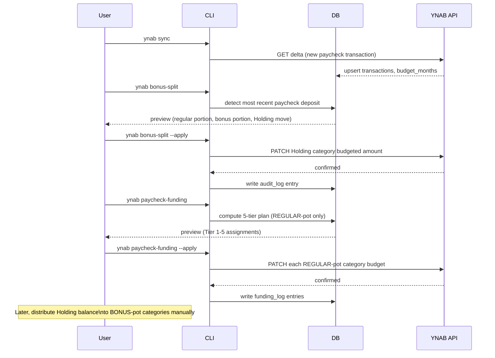

# Two-Pot Methodology

Most YNAB users think of income as a single stream. If your compensation includes both a predictable semi-monthly salary and periodic bonuses, treating them as one pool creates a recurring problem: you try to fund savings goals from every paycheck, then scramble when the bills hit a month where no bonus landed.

The two-pot system solves this by splitting categories into two buckets that match your two income types:

- **REGULAR-pot**: funded from every semi-monthly paycheck. Monthly bills, groceries, gas, subscriptions, utilities, and everyday spending.
- **BONUS-pot**: funded from bonuses only. Savings, emergency fund, retirement, sinking funds for big purchases, vacations, annual expenses, and anything else that doesn't need to happen this month.

Regular paychecks cover regular life. Bonuses fill the long-term goals. Neither pot borrows from the other.

## How Classification Works

A category lands in the BONUS-pot if any of these match:

1. Its exact name is listed in `bonus_funded_categories`
2. Any substring from `bonus_funded_groups` appears in the category's group name or the category name itself (case-insensitive)

Everything else (minus categories in `excluded_groups` or `excluded_categories`) is REGULAR-pot.

The default `bonus_funded_groups` value covers the most common savings-style group names:

```
Savings, Retirement, Holding, Investment, Emergency
```

If your YNAB group names don't match these substrings, set your own:

```json
{
  "bonus_funded_groups": "Savings Goals,Long-Term,Retirement,Vacation Fund"
}
```

One-off categories that live in otherwise REGULAR-pot groups can be individually overridden:

```json
{
  "bonus_funded_categories": "Annual Membership,Life Insurance Premium"
}
```

## Configuration Reference

All values can be set in `~/.config/ynab-tools/config.json` or as environment variables.

| Config key | Env var | Default | Purpose |
|---|---|---|---|
| `regular_pay` | `YNAB_REGULAR_PAY` | (required) | Typical semi-monthly paycheck amount; paychecks above this threshold are flagged as containing a bonus |
| `holding_category` | `YNAB_HOLDING_CATEGORY` | `"Holding: Next Month"` | Category where the bonus portion is parked before you distribute it |
| `bonus_funded_groups` | `YNAB_BONUS_FUNDED_GROUPS` | `"Savings,Retirement,Holding,Investment,Emergency"` | Comma-separated group name substrings treated as BONUS-pot |
| `bonus_funded_categories` | `YNAB_BONUS_FUNDED_CATEGORIES` | `""` | Comma-separated exact category names treated as BONUS-pot regardless of group |
| `excluded_groups` | `YNAB_EXCLUDED_GROUPS` | `"Credit Card Payments,Internal Master Category"` | Group substrings excluded from all paycheck funding tiers entirely |
| `excluded_categories` | `YNAB_EXCLUDED_CATEGORIES` | `""` | Exact category names excluded from all tiers |

## Commands

| Command | What it does |
|---|---|
| `ynab breakdown` | Lists every category classified as REGULAR-pot or BONUS-pot with 3-month average spend and the regular-paycheck total needed |
| `ynab bonus-split` | Dry-run preview of splitting a large paycheck into regular and bonus portions |
| `ynab bonus-split --apply` | Moves the bonus portion into the Holding category |
| `ynab paycheck-funding` | 5-tier priority-based funding plan using only REGULAR-pot categories |
| `ynab paycheck-funding --apply` | Pushes the funding plan to YNAB |

## Bonus Paycheck Day Workflow

When a paycheck arrives that is larger than `YNAB_REGULAR_PAY`, run `bonus-split` before `paycheck-funding`. This separates the bonus portion into the Holding category so it doesn't inflate your RTA and accidentally fund REGULAR-pot categories beyond what you intended.



After `paycheck-funding --apply`, the Holding balance remains untouched until you choose to distribute it. Use `ynab fund "Vacation Fund" +500` or similar to move amounts from Holding into individual BONUS-pot categories on your own schedule.

## Checking Your Classification

Before relying on the two-pot workflow, verify your categories are classified correctly:

```bash
ynab breakdown
```

The output shows every non-excluded category in two columns: REGULAR-pot and BONUS-pot. Categories that land in the wrong column need a configuration adjustment, not a YNAB restructure.

Common misclassification causes:
- A savings category lives in a group that doesn't match any `bonus_funded_groups` substring. Fix: add the group substring or add the category name to `bonus_funded_categories`.
- A REGULAR-pot category lives in a group that accidentally matches a bonus substring (e.g., a "Savings Account Transfer" group you use for tracking, not goals). Fix: rename the group or add the category to `excluded_categories`.

## Dashboard Panel

The dashboard includes a Two-Pot panel at the `/two-pot` route. It shows the current regular-pot budget total vs average spend, the Holding category balance, and flags any categories that appear to be misclassified based on your configured substrings.

## Related

- [Workflows](workflows.md) - paycheck day and month-end step-by-step sequences
- [Configuration](configuration.md) - full env var reference
- [Commands](commands.md) - complete CLI reference
