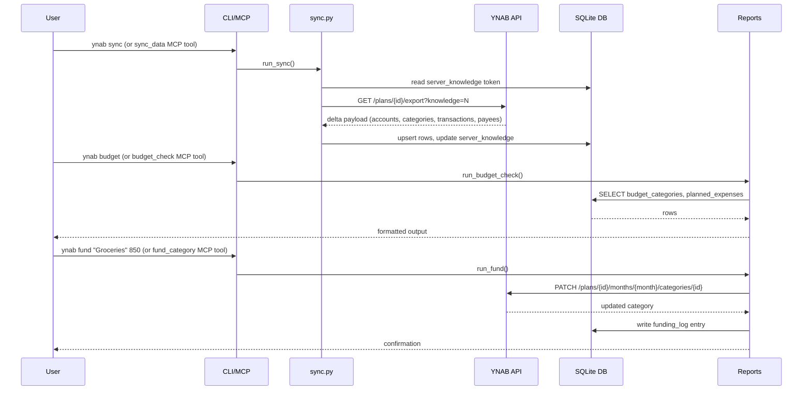
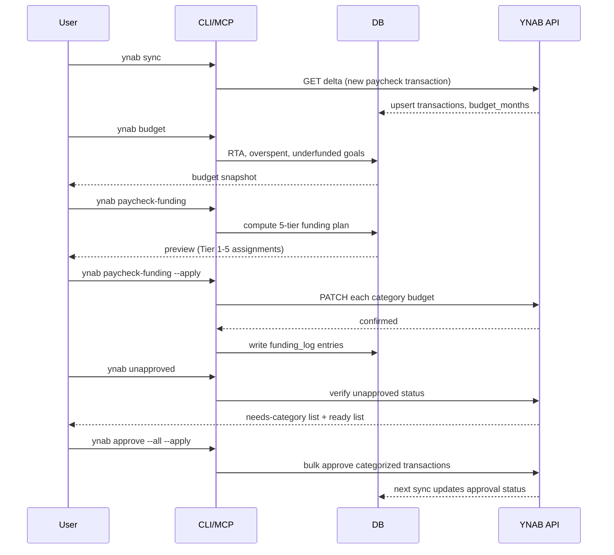
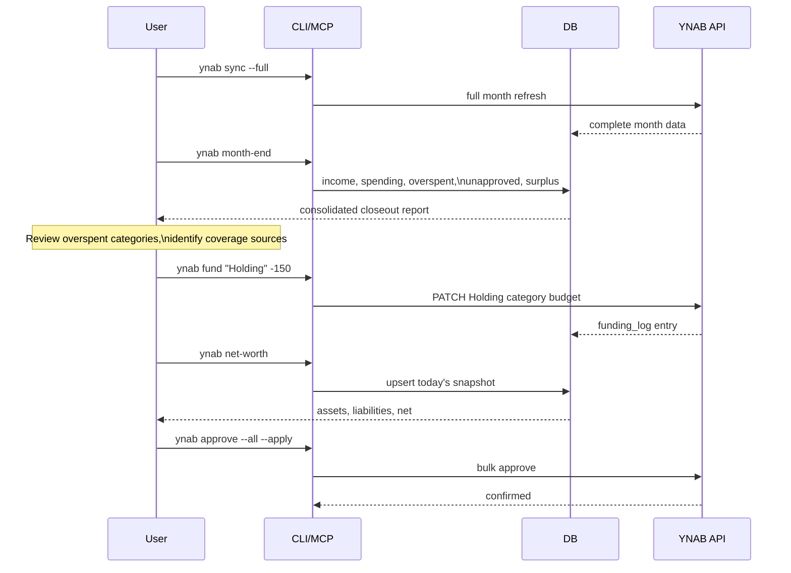
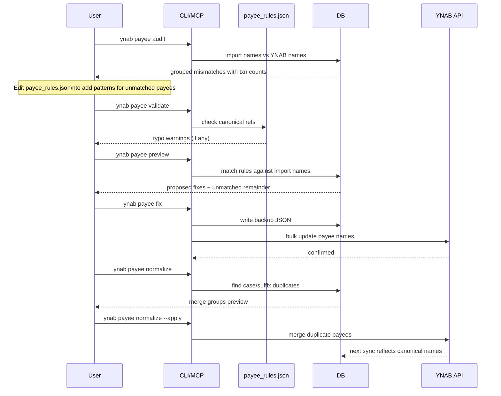

# Workflows

ynab-tools is designed around a repeating cycle: sync from YNAB, analyze locally, take action, push changes back. Every write operation completes the loop by updating YNAB and recording the action in the local audit log, so the next sync picks up a clean state.

## Sync and Data Flow

Each sync fetches only changes from YNAB using `server_knowledge` delta tokens. Write operations call the YNAB API directly, then record the action in the local audit log.

## Paycheck Day Workflow

Run after each paycheck lands to fund categories in priority order and verify everything is accounted for.

If your compensation includes bonuses, run `ynab bonus-split` before `ynab paycheck-funding` to separate the bonus portion into the Holding category first. See [Two-Pot Methodology](two-pot-methodology.md) for the full workflow.

## Weekly Review Workflow

A lighter-weight mid-week or weekend check to stay on top of spending pace and transaction cleanliness.

1. `ynab sync` - pull the latest transactions
2. `ynab spending` - flag categories over budget or running hot
3. `ynab spending-pace` - check intra-month pace; spot categories running ahead of budget
4. `ynab recent -n 50` - scan for anything unexpected; look for `[!]` (uncategorized) and `[?]` (unapproved)
5. `ynab categorize` - review suggestions for uncategorized transactions
6. `ynab categorize --apply` - push HIGH-confidence categories to YNAB

## Month-End Workflow

Close out the month, cover any overspending, take a net worth snapshot, and carry forward a clean slate.

## Payee Cleanup Workflow

Periodic cleanup to fix messy bank import names, merge duplicates, and prune orphaned payees. Run this after accumulating a batch of new import names or whenever `ynab payee audit` surfaces unmatched patterns.

`ynab_tools/data/payee_rules.json` ships empty. You build it up over time by running `ynab payee audit`, identifying unmatched import patterns, and adding rules for them. See `ynab_tools/data/payee_rules.example.json` for the format.

